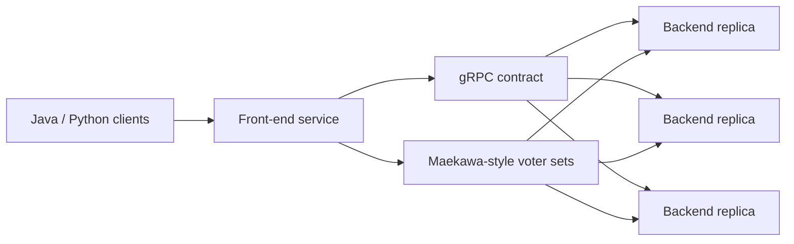

# Replicated TupleSpaces

> A Linda-style coordination service with replicated storage and quorum-coordinated distributed operations.

[](https://openjdk.org/)
[](https://grpc.io/)
[](https://github.com/jorgeflmendes/replicated-tuplespaces/actions/workflows/ci.yml)

Replicated TupleSpaces implements a distributed coordination service with Java,
gRPC, Protocol Buffers, and a complementary Python client. It exposes blocking
Linda-style tuple operations and coordinates distributed `take` requests
through intersecting voter sets inspired by Maekawa's mutual exclusion
algorithm.

## Overview

Clients interact with a front-end service that orchestrates multiple backend
replicas. `put` distributes tuples, `read` waits for a matching value, and
`take` coordinates selection and removal across replicas. Tuple patterns are
expressed as Java-compatible regular expressions.

The project demonstrates RPC contract design, replicated state, concurrency,
blocking operations, quorum coordination, and multi-module service
organization.

## Academic Context

This project was developed as part of the **Distributed Systems** course unit
at **Instituto Superior Técnico, University of Lisbon**.

This project explores replicated coordination services, concurrency,
consistency, fault tolerance, and distributed communication.

## Key Features

- `put`, `read`, `take`, and `getTupleSpacesState` operations
- Protocol Buffer API contracts and generated gRPC bindings
- Java backend replicas and coordinating front-end
- Blocking pattern-based reads and takes
- Maekawa-style voter sets for distributed `take`
- Java and Python command-line clients
- Multi-module Maven build

## Architecture



For `take`, the front-end requests candidates from a voter set, intersects the
returned tuple sets, selects a common tuple, and asks all replicas to remove
it. Replica-side operation identifiers and pattern locks prevent incompatible
concurrent selections.

See [docs/ARCHITECTURE.md](docs/ARCHITECTURE.md) for the component and request
flow in more detail.

## Tech Stack

- Java 17
- Maven 3.8+
- gRPC and Protocol Buffers
- Python 3.10+ client
- GitHub Actions

## Repository Structure

```text
.
|-- contract/              # Protobuf contracts and generated bindings
|-- common/                # Shared coordination primitives
|-- single-server/         # TupleSpaces backend replica
|-- front-end/             # Client-facing coordination service
|-- client-java/           # Java CLI
|-- client-python/         # Python CLI
|-- docs/                  # Architecture documentation
`-- pom.xml                # Multi-module build
```

## Getting Started

Prerequisites: Java 17, Maven 3.8+, and Python 3.10+ for the Python client.

```bash
git clone https://github.com/jorgeflmendes/replicated-tuplespaces.git
cd replicated-tuplespaces
mvn clean install
```

Start three backend replicas in separate terminals:

```bash
cd single-server
mvn exec:java -Dexec.args="3001"
```

Repeat with ports `3002` and `3003`, then start the front-end:

```bash
cd front-end
mvn exec:java -Dexec.args="2001 localhost:3001 localhost:3002 localhost:3003"
```

Start the Java client:

```bash
cd client-java
mvn exec:java -Dexec.args="localhost:2001 1"
```

Or install and run the Python client:

```bash
python -m pip install -r client-python/requirements.txt
python client-python/client_main.py localhost:2001 1
```

Example commands:

```text
put <user,42,active>
read <user,.*>
take <user,.*,active>
getTupleSpacesState
```

## Running Tests

```bash
mvn test
```

GitHub Actions compiles and tests the Maven reactor on pushes and pull requests.
The repository also contains command-script samples under `tests/` for manual
multi-process validation.

## Limitations

- The implementation is an academic prototype, not a production coordination service.
- Failure recovery and durable replica storage are outside the current scope.
- Pattern matching follows Java `String.matches(...)` semantics.
- End-to-end distributed scenarios still require manual multi-process startup.

## Roadmap

- Add automated multi-replica integration tests
- Document consistency and failure guarantees explicitly
- Add deterministic fault-injection scenarios
- Package local cluster startup with containers

## Usage Note

No standalone repository license is currently included. The implementation and
upstream course materials should not be redistributed or reused without
reviewing the applicable terms.

## References

- [Distributed Systems project](https://github.com/tecnico-distsys/Tuplespaces-2025)
- [gRPC documentation](https://grpc.io/docs/)
