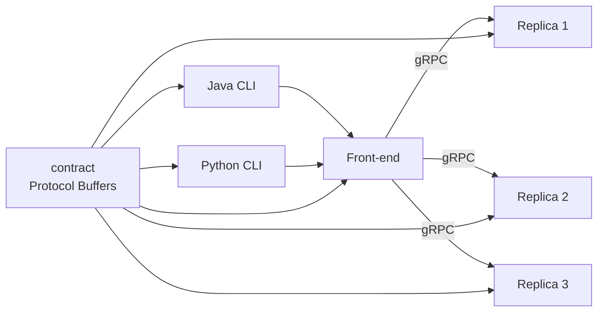
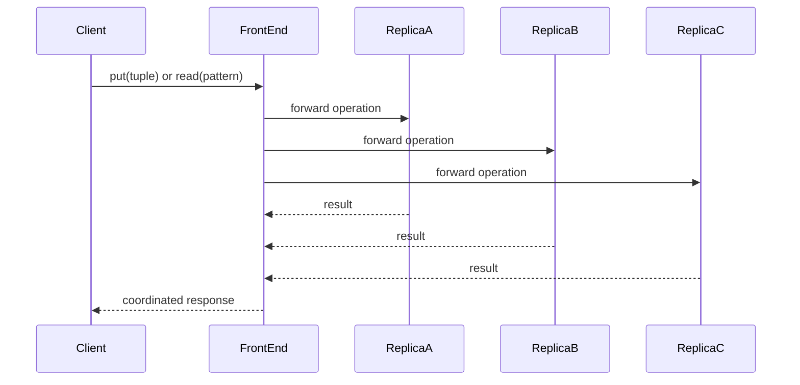
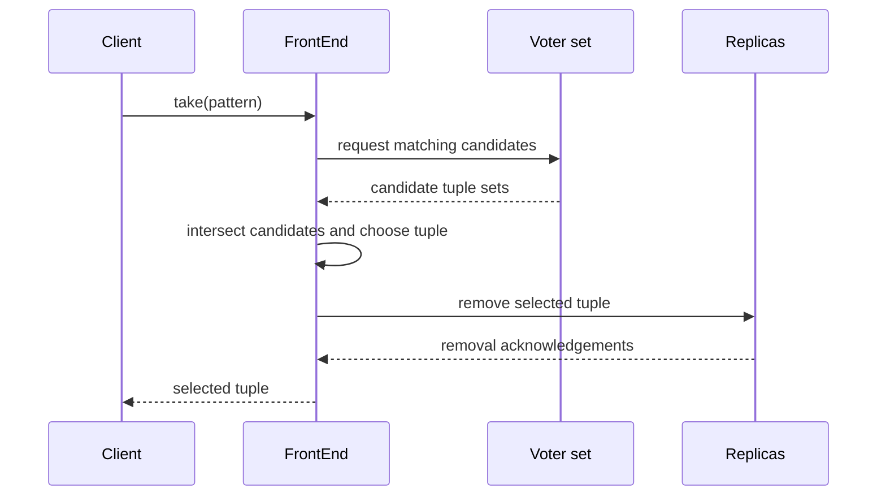
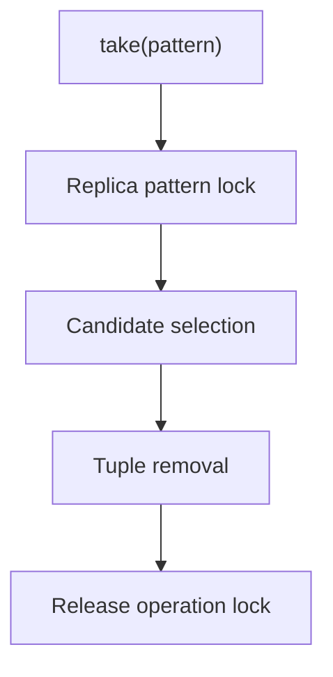

# Replicated TupleSpaces Architecture

This document describes the client, front-end, contract, and replica
boundaries for the replicated Linda-style coordination service.

## System Context

Clients speak only to the front-end. Backend replicas own tuple state, while
the front-end owns cross-replica orchestration.

## Request Flows

### Put and read

`read` may block inside replicas until a matching tuple is available. Pattern
matching follows Java `String.matches(...)` semantics.

### Take

The front-end coordinates `take` using intersecting voter sets. Replica-side
operation identifiers and pattern locks prevent incompatible concurrent
selections from committing independently.

## Module Responsibilities

| Module | Responsibility | Boundary |
| --- | --- | --- |
| `contract` | Protobuf service definitions and generated bindings | Centralizes API compatibility |
| `common` | Shared Java coordination primitives | Avoids duplicate runtime concepts |
| `front-end` | Client-facing service and cross-replica orchestration | Does not own tuple storage |
| `single-server` | Backend tuple state, waiting operations, locks, and scheduling | Does not expose public client policy |
| `client-java` | Java command shell | Converts user commands to RPC calls |
| `client-python` | Python command shell | Mirrors the public client protocol |

## Locking Boundary

Locks are local replica coordination mechanisms. They reduce conflicting
selection races but do not provide durable recovery or production-grade fault
tolerance.

## Architectural Constraints

- Replica storage is in memory; durable recovery is outside the current scope.
- End-to-end distributed scenarios require manual multi-process startup.
- The implementation is an academic prototype, not an operational coordination
  service.
- Failure handling is limited to the behavior represented in the course
  project and tests.
